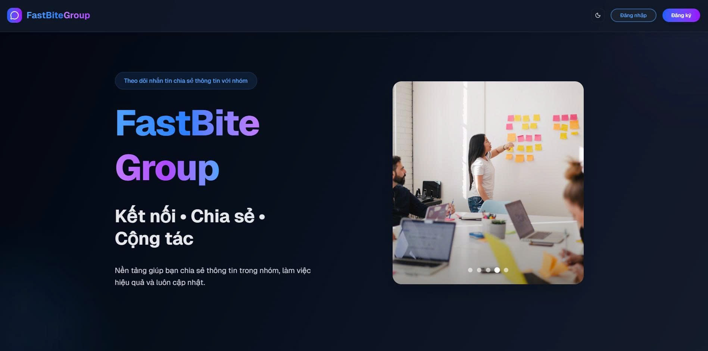
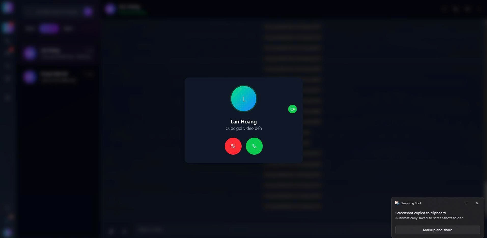
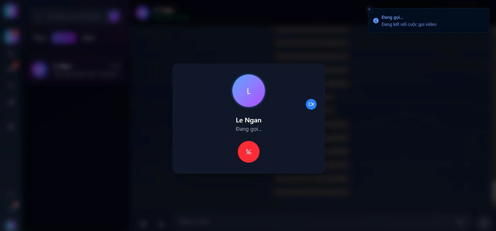
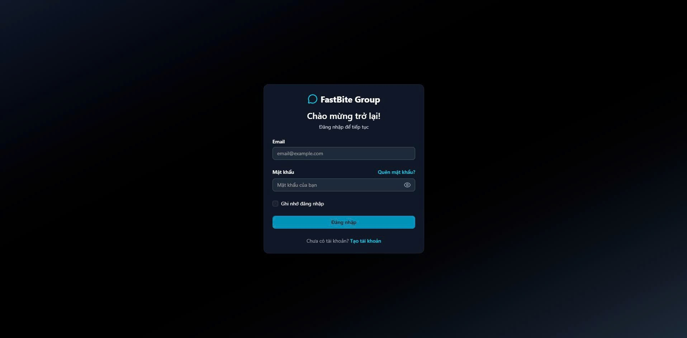
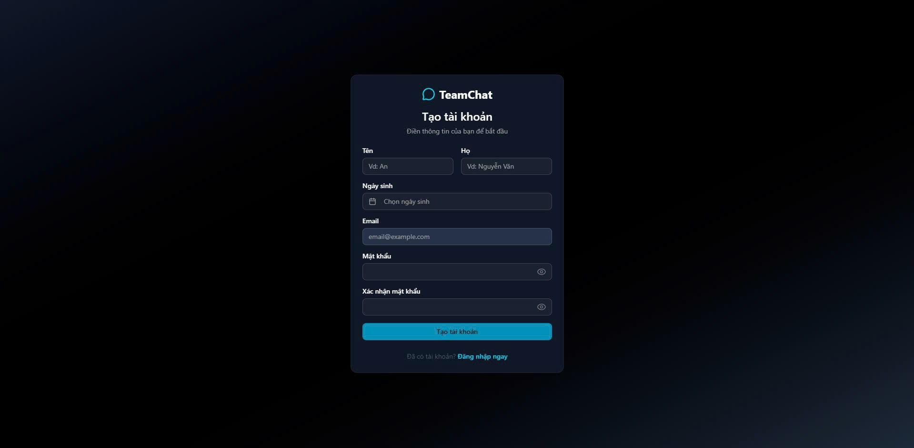
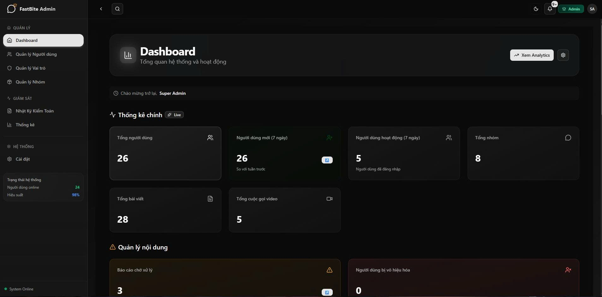
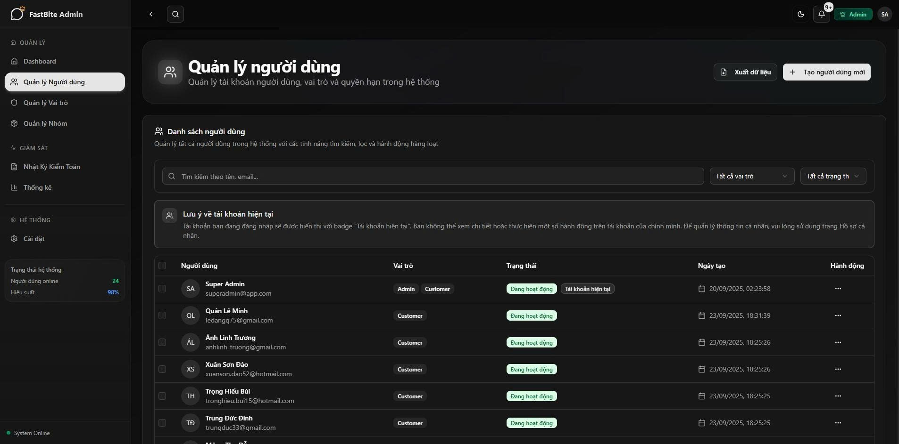
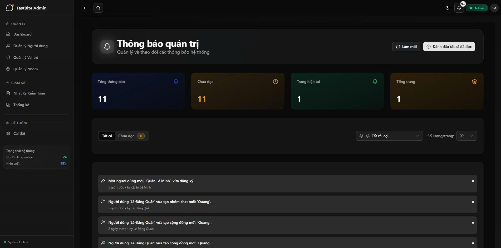
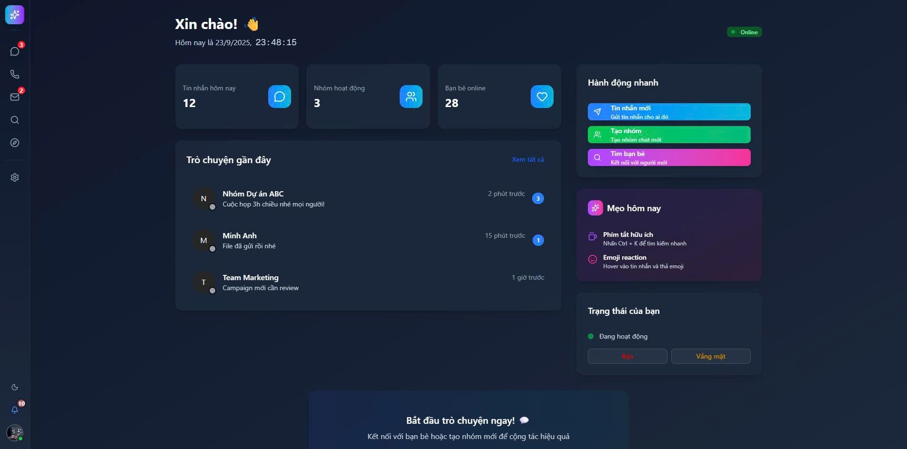
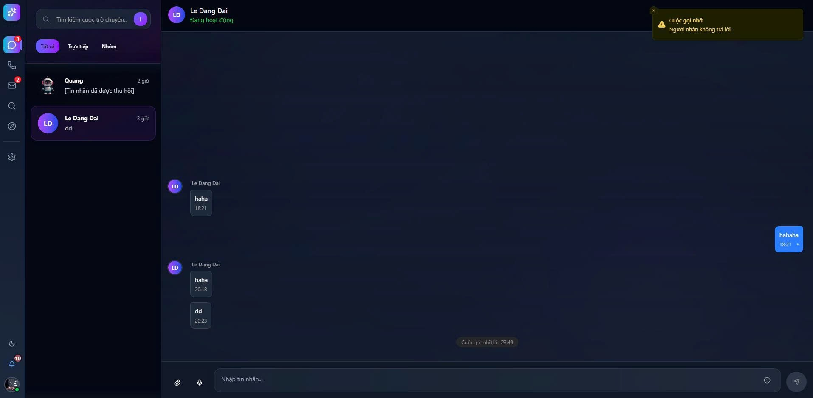

# FastBite Group - Frontend Application

## 🚀 Project Overview

**FastBite Group** is a modern, real-time collaboration and communication platform designed to empower teams and communities. It centralizes messaging, group discussions, file sharing, and high-quality video conferencing into a single intuitive interface.

**Why it exists:** With the rise of remote work and digital communities, there is a growing need for cohesive platforms that bring multiple communication channels together without relying on disjointed third-party tools. FastBite Group eliminates context switching by consolidating chat, forums, and live video.

**Who should use it:** Remote teams, enterprise organizations, study groups, and online communities looking for a secure, customizable, and high-performance communication hub.

---

## 🧠 Architecture Overview

FastBite Group is built as a **Single Page Application (SPA)** utilizing **Server-Side Rendering (SSR) and Client-Side Rendering (CSR)** capabilities provided by Next.js App Router.

### Data Flow
1. **User Interaction:** The user interacts with the UI (built with Radix UI & Tailwind CSS).
2. **State Management:** Local UI state is handled by React component state or `Zustand` (for cross-component state like active video calls or theme preferences).
3. **Data Fetching & Caching:** `React Query` acts as the primary data orchestrator, fetching data via `Axios` and caching it locally to minimize redundant network requests.
4. **Real-time Updates:** 
   - **SignalR:** Maintains persistent WebSocket connections for instant chat messages and notifications.
   - **LiveKit:** Handles WebRTC infrastructure for low-latency audio/video transmission.

---

## 🛠 Tech Stack

**Core Framework & Routing:**
* Next.js 15 (App Router)
* React 19
* TypeScript

**State Management & Data Fetching:**
* Zustand (Global State)
* @tanstack/react-query (Server State & Caching)

**Real-time Communication:**
* @microsoft/signalr (Real-time messaging & WebSockets)
* LiveKit / @livekit/components-react (WebRTC Video & Audio Calls)
* React OneSignal (Push Notifications)

**Styling & UI Components:**
* Tailwind CSS
* Shadcn UI (Radix UI Primitives)
* Lucide React (Icons)
* Next-Themes (Dark/Light mode support)

**Forms & Validation:**
* React Hook Form
* Zod

**Rich Text Editor:**
* Tiptap (Headless rich-text editor for posts and messages)

---

## ✨ Features

### 💬 Messaging & Communication
* **Private Messaging:** Encrypted 1-on-1 direct conversations.
* **Group Chats:** Topic-based channels with active moderation.
* **Real-time Notifications:** In-app and push notifications for mentions and new messages.
* **Rich Text Editing:** Format messages, embed links, and create lists using Tiptap.

### 🎥 Video & Audio Conferencing
* **HD Video Calls:** Built-in video meetings powered by LiveKit.
* **Screen Sharing:** Seamlessly share windows or entire screens during meetings.
* **Participant Management:** Controls for muting, deafening, and removing participants.

### 🌐 Community Features
* **Group Posts (Forums):** Share structured updates and announcements.
* **Role-based Access Control:** Distinct `Admin` and `Customer/Member` access paths.
* **Presence Indicators:** See who is online in real-time.

### 🎨 UI & Customization
* **Dynamic Theming:** Instant switching between Light and Dark modes.
* **Fully Responsive:** Optimized experiences across desktop, tablet, and mobile browsers.

---

## 📂 Folder Structure

```text
src/
├── app/                  # Next.js App Router pages and layouts
│   ├── (admin)/          # Admin-specific routes and dashboards
│   ├── (customer)/       # End-user/Client routes
│   └── video-call/       # Dedicated meeting room routes
├── components/           # Reusable React components
│   ├── features/         # Complex, domain-specific components (chat, video, posts)
│   ├── shared/           # Cross-feature common components (ThemeToggle, etc.)
│   └── ui/               # Base UI primitives (Shadcn customized components)
├── hooks/                # Custom React hooks containing business logic
│   ├── useLiveKit*.ts    # WebRTC session management hooks
│   ├── useVideoCall*.ts  # Active call state hooks
│   └── useFileUploader.ts# Abstractions for file uploads
├── lib/                  # Utility functions and API clients
│   ├── api/              # Axios configurations, interceptors, and typed HTTP endpoints
│   └── schemas/          # Zod validation schemas
├── store/                # Zustand global state slices
│   ├── authStore.ts      # Client-side authentication state
│   └── videoCallStore.ts # Global video call state orchestration
├── types/                # TypeScript interfaces and type definitions
└── utils/                # Pure helper functions (date formatting, text parsing)
```

---

## ⚙️ Setup & Run

### Prerequisites
* Node.js (v20+)
* pnpm (recommended) or npm

### 1. Install Dependencies
```bash
pnpm install
```

### 2. Environment Variables
Create a `.env.local` file in the project root and add the necessary environment variables. (Reference `.env.example` if available). Expected variables include API endpoints, LiveKit WebRTC keys, and OneSignal App IDs.

### 3. Run Development Server
```bash
pnpm run dev
```
The application will be running with Turbopack enabled for faster startup times at `http://localhost:3000`.

### 4. Build for Production
```bash
pnpm run build
pnpm run start
```

---

## 🔌 API Integration

The frontend communicates with a unified backend via an `Axios` instance configured in `src/lib/api/apiClient.ts`. 

* **Authentication:** Handles JWT token injection into the `Authorization` header via interceptors. Handles seamless token refreshing on 401 Unauthorized responses.
* **Queries & Mutations:** All API calls are wrapped in `React Query` hooks inside the respective component or feature folder, ensuring that race conditions, caching, and retries are managed automatically.
* **Real-time Pipeline:** The `presenceStore` and `useLiveKitControls` hooks listen strictly to SignalR and LiveKit Webhook events rather than relying on HTTP polling (with `notification-polling.ts` serving as a fallback).

---

## 📸 Screenshots

The following screenshots demonstrate different aspects of the FastBite Group application:

| | |
|:---:|:---:|
| <br>**Landing Page** | <br>**Group Chat Interface** |
| <br>**Video Conference** | <br>**Dashboard View** |
| <br>**Platform View** | <br>**Platform View** |
| <br>**Platform View** | <br>**Platform View** |
| <br>**Platform View** | <br>**Platform View** |
| <br>**Platform View** | |

---

## 🚧 Limitations / Future Improvements

* **Next.js 15 Turbopack Stability:** Currently using Turbopack in development (`--turbopack`). As Next.js 15 evolves, continuous monitoring is required to ensure complex LiveKit module resolution doesn't break.
* **Offline Support & PWA:** The app currently relies heavily on a stable network for its SPA experience. Implementing a Service Worker to cache the React Query state and serve static assets could drastically improve perceived load times on mobile.
* **Micro-Frontend Exploration:** As the `admin`, `video-call`, and `chat` feature sets grow, the JavaScript bundle size will balloon. We should consider dynamically loading chunked feature sets strictly when a user navigates to those specific routes, possibly using Next.js advanced dynamic imports.
* **E2E Testing Pipeline:** Currently lacks visible End-to-End testing frameworks (like Cypress or Playwright) in the `package.json`. Critical real-time user flows (e.g., initiating a video call, receiving a SignalR notification) need automated coverage.
